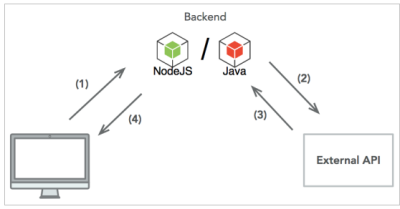
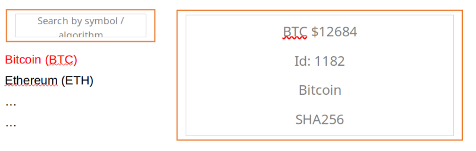

New Employee Evaluation
=======================

## Executive: running the app (embedded Tomcat)

* `cd crypto-compare-proxy`

* `mvn clean package spring-boot:run -DskipTests=true`

* Navigate to (http://localhost:8080)

## Executive: Deploying on external Tomcat 9

* `cd crypto-compare-proxy`

* `mvn clean package -DskipTests`

* `cp target/crypto-compare-proxy.war $CATALINA_HOME/webapps`

* `. $CATALINA_HOME/bin/catalina.sh start`

*  Navigate to (http://localhost:8080/crypto-compare-proxy)

## To install on eclipse IDE

* make sure you have [lombok 1.18.24](https://projectlombok.org/download) in eclipse installation directory (along side with `eclipse.ini` file).

* add the entry `-javaagent:/<path-to-eclipse-ide>/eclipse-jee-2022-06-R/lombok.jar` at the end of the `eclipse.ini` file.

* use the `File -> import -> Maven -> existing maven projects` menu and navigate to the root of this directory.

* make sure you see the `pom.xml` file in the import wizard and confirm.

* allow sufficient time for maven plugin to download all the project dependencies

## Backend - Cryptocurrency API

Create a webapp (Node.js+express or Java+spring) which acts as Cryptocurrency API Proxy.

The server should request results from an external api (www.cryptocompare.com/api).
The results should be cached and stored in-memory, using data structures of your choice.
The currency should be cached for a configurable amount of time (AKA cachettl, default is 15000ms) – after ttl the currency value is outdated and invalid.

## The following REST API for digital coins should be implemented:

* GET    /coins list all coins names (coinName only)

  * ?algorithm=<...> return coins with the desired algorithm

  * ?symbol=<...>,<...>... returns coins with desired symbol/s

* GET    /coins/:symbol return single coin with all properties, including currency

* POST /cachettl  {“ttl”: <number>} change the cachettl for items currency.
returns old value (oldValue) and updated value (newValue).

  * Should be protected by validating “x-admin-key” header has a valid key (in admin-key file)

  * “x-admin-key” is just some random http header used in this exercise

## Coins should have the following properties:

* id: number (1182),

* symbol: string ("BTC"),

* coinName: string ("Bitcoin"),

* algorithm: string ("SHA256"),

* toUSD: float (12684.72),

* additional properties if needed…

## External API - [www.cryptocompare.com/api]("www.cryptocompare.com/api")

* The desired API should be implemented by using 2 external API requests:

* [https://min-api.cryptocompare.com/data/all/coinlist](https://min-api.cryptocompare.com/data/all/coinlist)  list all coins w/o currency

* [https://min-api.cryptocompare.com/data/pricemulti?fsyms=ETH,BTC&tsyms=USD](https://min-api.cryptocompare.com/data/pricemulti?fsyms=ETH,BTC&tsyms=USD) get currency by symbol, note that it supports multiple symbols: <symbol>,<symbol>,<symbol>

## Frontend – Master/Detail view

Build a web client application that interact with the API.

The client should have a single page, master/detail view with a list of coins and a detailed view for some single coin. It should look as follows (UI is not important, functionality matters):

The list should be loaded on start (GET /coins), without any coin selected.
Clicking on some coin in the list, will show it’s details (GET /coins/:symbol) in the detailed view.
The search box will receive input for symbol or algorithm and uses the exposed API to show results (GET /coins?algorithm=<..>&symbol=<..>)

### Notes:

* You can use any framework you wish (Angular, React) or plain Javascript / jQuery

* Same applies for UI kits (Bootstrap)

* If the backend is missing / not working, use plain json files to load data from

  * Use the external API (www.cryptocompare.com/api) to create the json files manually

  * Calling the external API directly from your client side code is not allowed

Search mechanism would be executed on the data within the given list in client side

### Instructions:

* Your solution should provide answers with minimum requests from the external API

* Log all external API requests

* Write down any important decisions and assumptions you are taking during the coding process

* Try to understand the problem and its attributes and prepare a short design for your most efficient solution represented in your preferred diagram (block, sequence, etc.)

  * Describe each object, interface and the relations between them

  * Explain the data structures in your solution

### Tips:

* A working but partial implementation is better than a partially working implementation

* Write your app modular as possible, it will help in case you won’t finish some parts

* Keep logic, utilities and persistence in separate modules

* Test your implementation using a REST client and unit tests

* For Node.js, you may use any npm package in your implementation (express is a must)

* Good luck!

## Running the client in offline mode

* By default, Google Chrome does not allow ajax to perform requests to the local file system.

* To test the client (index.html) in offline mode, run google chrome with the `--allow-file-access-from-files` flag

* for example: `/usr/bin/google-chrome --allow-file-access-from-files`

## Running the Application

* `mvn clean package spring-boot:run -DskipTests=true`

* Navigate to (http://localhost:8080)

## Test the REST API with curl

### Coin Keys

* list all coins: `curl -v http://localhost:8080/coins | jq .`

* list all coins by symbol: `curl -v http://localhost:8080/coins?symbol=ZZZ,BTC | jq .`

* list all coins by algorithm: `curl -v http://localhost:8080/coins?algorithm=SHA-256 | jq .`

### Coin keys with coin data - (no currency)

* list all coins `curl -v http://localhost:8080/coins/data | jq .`

### Coin with USD currency

* list single coin by symbol: `curl -v http://localhost:8080/coins/BTC | jq .`

### Change cache ttl

* `curl -X POST http://localhost:8080/cachettl -H "Accept: application/json" -H "Content-Type: application/json" -H "x-admin-key: f6f6ccb014b3bae0e5fe508f56196e007f01be2fcb6027a290a62fd4bf23bd68" -d '{"ttl": 15000}' | jq .`

